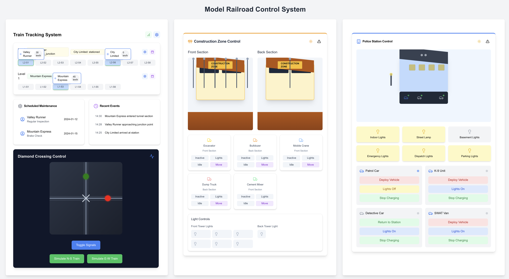
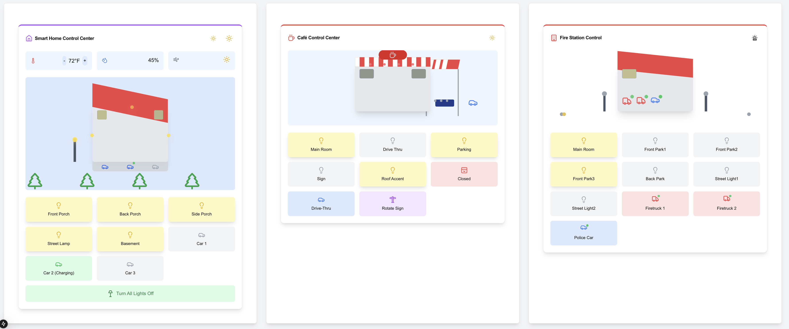
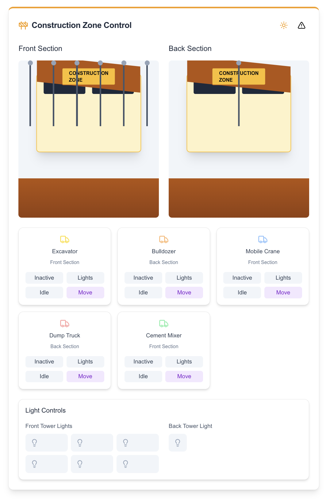
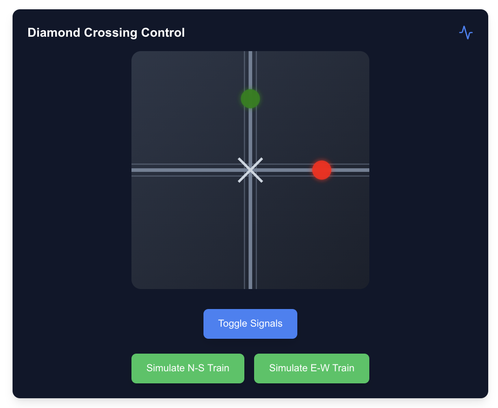
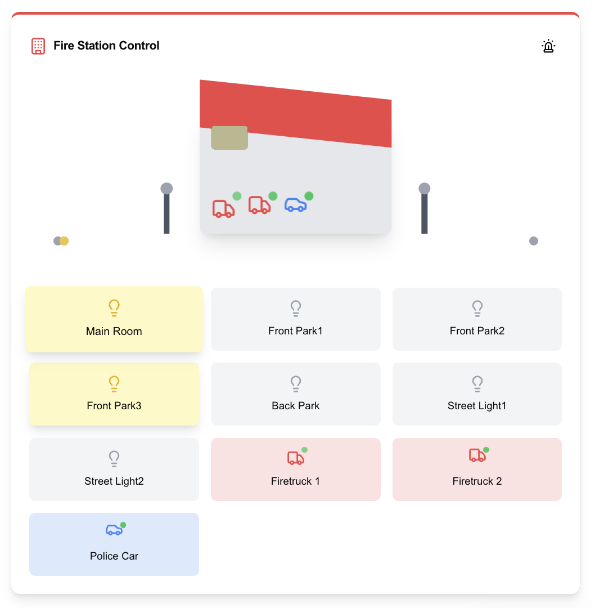
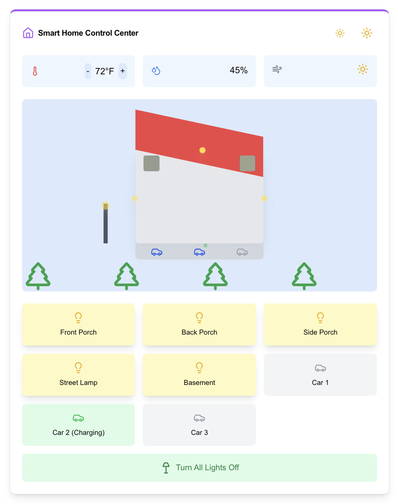
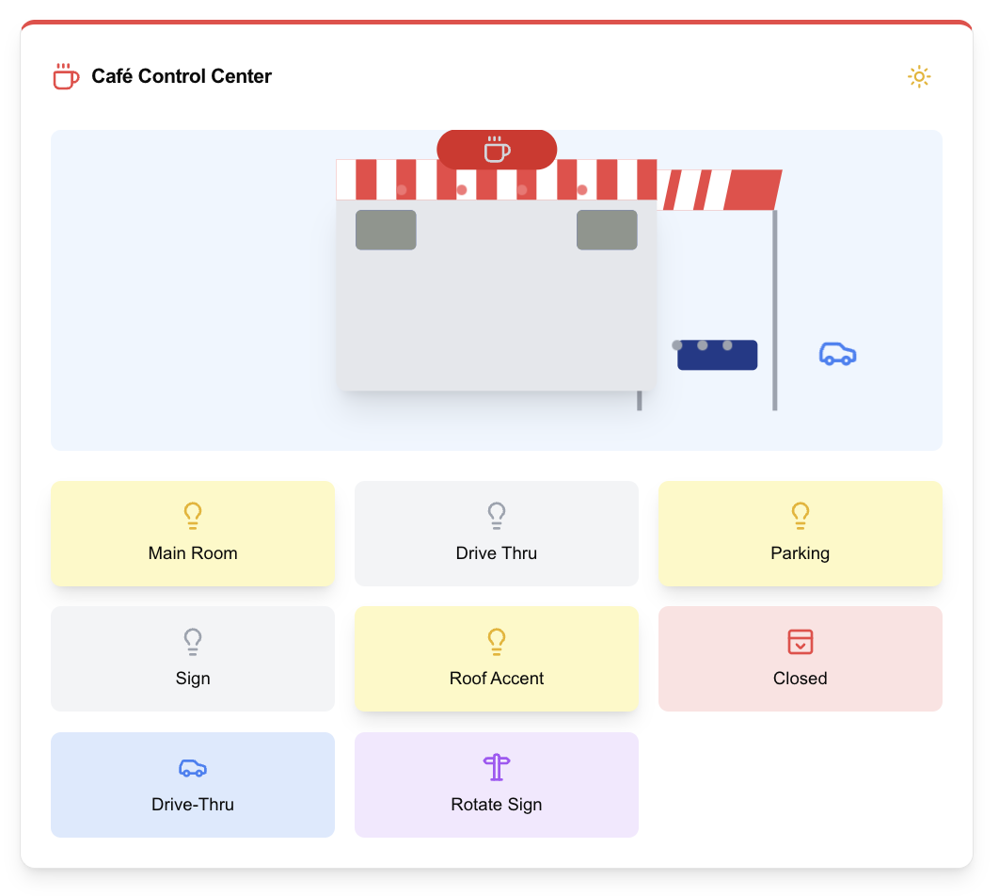
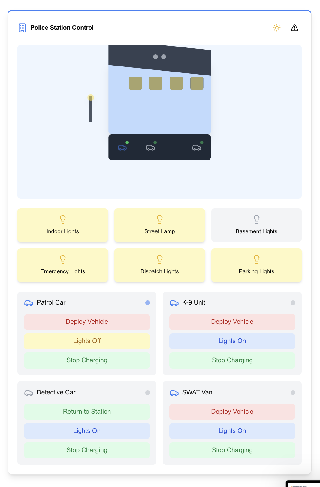
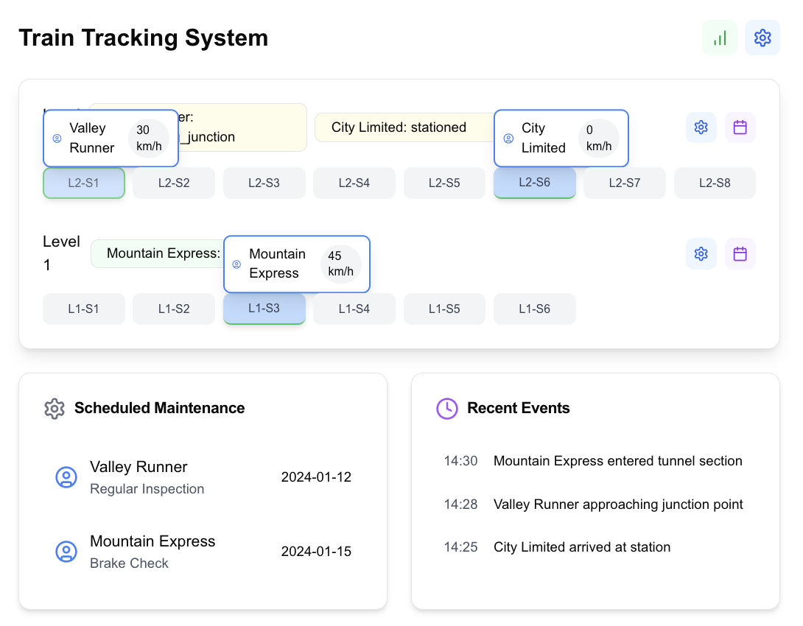

# Model RailRoad Control Panel

# Components

## Actions that can be taken on each Component

# ScreenShots For All Components



## Construction Zone


## Diamond Crossing (1 on the entire layout)


## FireStation Control 


## House Control System


## ModelCafe Control


## PoliceStation Control


## TrainTracking System


# Tree of the project important dir and files:

```bash
@punitmishra ➜ /workspaces/model-railroad-ui/frontend-app (main) $ tree app/
app/
├── components
│   ├── ConstructionZoneControl.tsx
│   ├── DiamondCrossing.tsx
│   ├── FireStationControl.tsx
│   ├── HouseControlSystem.tsx
│   ├── ModelCafeControl.tsx
│   ├── PoliceStationControl.tsx
│   └── TrainTrackingSystem.tsx
├── favicon.ico
├── globals.css
├── layout.tsx
└── page.tsx

1 directory, 11 files
@punitmishra ➜ /workspaces/model-railroad-ui/frontend-app (main) $ tree components/
components/
└── ui
    ├── alert.tsx
    ├── button.tsx
    └── card.tsx

1 directory, 3 files
@punitmishra ➜ /workspaces/model-railroad-ui/frontend-app (main) $ 
```